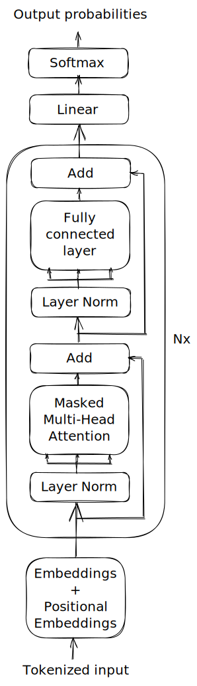

# gpt_ua

GPT-like language model from scratch trained on UberText 2.0. wikipedia subcorpora.

## Structure
  

Neural network consists from learnable embeddings block which has token embeddings and positional embeddings added up
together, N attention blocks and last Linear + Softmax layer to generate output probabilities of the next token in 
dictionary. 

Each attention block consists of a Multi-head self-attention and Fully connected layer with residual connection and layer norm before the subblock. For the activation function, ReLU is used.

Output probabilities are used for next token generation in an autoregressive fashion: the process starts with an input string, it gets tokenized and inputed in model, after that we sample from output distribution and get next token, process continues until the max_token threshold is hit.

## Train
All directions described in here were tested and written for Linux.

To train the model first you need to create virtual environment with all the necessary libs:
```sh
python -m venv .venv
source .venv/bin/activate
pip install -r requirements.txt
```

After creating the environment you need to download dataset. 
To do this you can run `download_data.sh` or download the **wikipedia** subcorpora split into sentences straight 
from [UberText 2.0.](https://lang.org.ua/en/ubertext/) website.

Tokenizer is included in the repository and can be used with 
HugginFace [tokenizer](https://huggingface.co/docs/transformers/main_classes/tokenizer) library.

To tokenize dataset and save it in binary file on disk you should run **Split and format to HF dataset** and 
**Tokenize dataset** sections in `experiments/03_tokenize_dataset.ipynb` Jupyter notebook. 

After having tokenized dataset in a file you can start training. Configs of the training process could be found in 
`src/config.py` file. To reproduce the results of this repo you should use standard config but you can change it inf
to match your needs.

Tokenizer used for this model is BPE tokenizer trained on the whole [UberText 2.0.](https://lang.org.ua/en/ubertext/) wiki subcorpora.

## Inference 
For inference pre-trained model is available. Weights and details about the pre-trained model are available [here](https://huggingface.co/nikiandr/gpt_ua).

For inference in auto-regressive fashion `src/inference.py` script is used:
```
usage: inference.py [-h] [--num_tokens NUM_TOKENS] [--device {cuda,cpu}]
                    <weights> <tokenizer_path> <start>

Inference of GPT network.

positional arguments:
  <weights>             path to model weights
  <tokenizer_path>      tokenizer file path
  <start>               start of string for generating

options:
  -h, --help            show this help message and exit
  --num_tokens NUM_TOKENS
                        number of tokens to generate (default: 100)
  --device {cuda,cpu}   device on which to run inference (default: cuda if available, else cpu)
```
